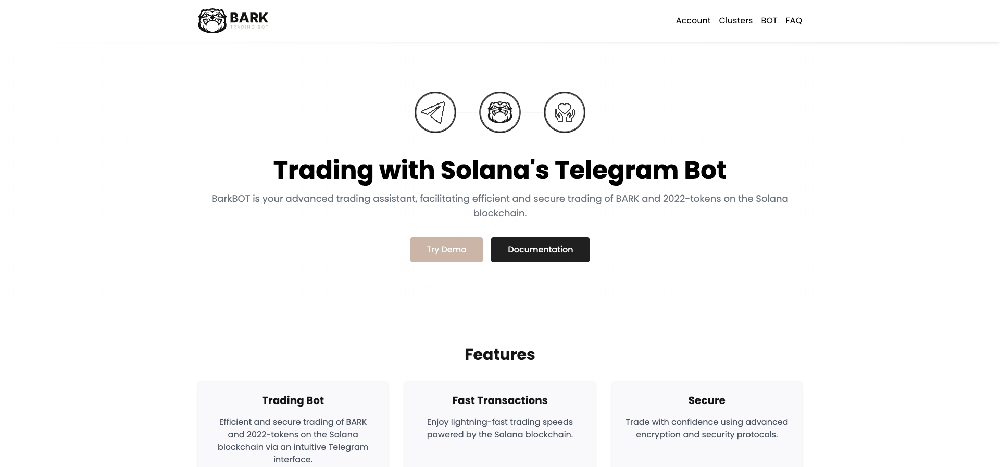
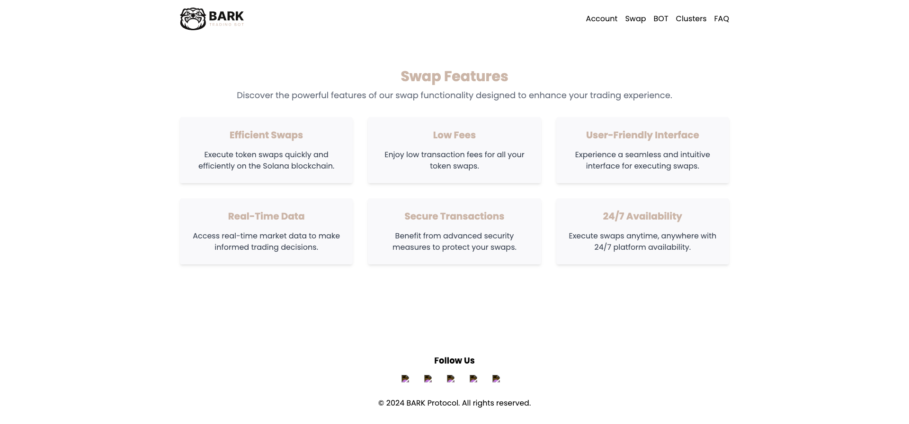

# BarkBOT

BarkBOT is a powerful trading assistant designed to facilitate efficient and secure trading of BARK and other tokens on the Solana blockchain through an intuitive Telegram interface. This repository contains the source code for the BarkBOT web application, including swap and bot features, built using modern web technologies such as React and Next.js.

## Dashboard UI



## Swap Features


## Table of Contents

- [Features](#features)
- [Technologies Used](#technologies-used)
- [Getting Started](#getting-started)
- [Setup](#setup)
- [Usage](#usage)
- [Project Structure](#project-structure)
- [Contributing](#contributing)
- [License](#license)
- [Screenshots](#screenshots)

## Features

### BarkBOT Telegram App Features

- **Instant Transactions**: Paste a token address into Telegram and instantly send a purchase transaction.
- **Powered by Jupiter**: Routing powered by Jupiter ensures the fastest and most efficient trades.
- **User-Friendly Interface**: Experience a seamless and intuitive Telegram BOT interface for executing swaps.
- **Comprehensive Analytics**: Gain insights into your trading performance with detailed analytics.
- **Secure Transactions**: Benefit from advanced security measures to protect your swaps.
- **Anti-Resistance**: Solana-2022 Extension minimizes pump and dump activities and fosters better token holder engagement.

### Swap Features

- **Efficient Swaps**: Execute token swaps quickly and efficiently on the Solana blockchain.
- **Low Fees**: Enjoy low transaction fees for all your token swaps.
- **User-Friendly Interface**: Experience a seamless and intuitive interface for executing swaps.
- **Real-Time Data**: Access real-time market data to make informed trading decisions.
- **Secure Transactions**: Benefit from advanced security measures to protect your swaps.
- **24/7 Availability**: Execute swaps anytime, anywhere with 24/7 platform availability.

## Technologies Used

- **React**: A JavaScript library for building user interfaces.
- **Next.js**: A React framework for server-side rendering and generating static websites.
- **Tailwind CSS**: A utility-first CSS framework for rapidly building custom user interfaces.
- **Solana**: A high-performance blockchain supporting decentralized applications and crypto-currencies.
- **Solana Wallet Adapter**: A library to simplify wallet integration with Solana applications.

## Getting Started

Follow these instructions to get a copy of the project up and running on your local machine for development and testing purposes.

### Prerequisites

- Node.js (v18.x or later)
- npm or yarn

### Setup

Clone the repository:

```bash
git clone https://github.com/bark-communitu/barkbot-webapp.git
cd barkbot-webapp
```

Install the dependencies:

```bash
npm install
# or
yarn install
```

### Environment Variables

Create a `.env.local` file in the root directory and add the necessary environment variables:

```env
NEXT_PUBLIC_SOLANA_RPC_URL=https://api.mainnet-beta.solana.com
NEXT_PUBLIC_JUPITER_API_URL=https://api.jup.ag
```

### Usage

Run the development server:

```bash
npm run dev
# or
yarn dev
```

Open [http://localhost:3000](http://localhost:3000) with your browser to see the application.

## Project Structure

```plaintext
├── components
│   ├── bot
│   │   ├── BotFeatures.tsx
│   ├── swap
│   │   ├── integrated-terminal.tsx
│   │   ├── swap-feature.tsx
│   │   ├── swap-features.tsx
│   ├── ui
│   │   ├── app-hero.tsx
│   │   ├── navigation.tsx
│   │   ├── ui-layout.tsx
│   ├── feature-cards.tsx
├── pages
│   ├── _app.tsx
│   ├── features
│   │   ├── page.tsx
│   ├── swap
│   │   ├── page.tsx
│   ├── index.tsx
├── public
│   ├── icons
│   ├── barkbot-logo-dark.svg
├── assets
│   ├── ui-screenshot.png
├── styles
│   ├── globals.css
├── .env.local
├── tailwind.config.js
├── next.config.js
├── README.md
```
## Documentation

- Bark**BOT** Project & API [API documentation](https://bark-protocol-1.gitbook.io/barkbot-or-telegram-solana-token-trading-bot/)

## Contributing

We welcome contributions from the community! Please follow these steps to contribute:

1. Fork the repository.
2. Create a new branch: `git checkout -b my-feature-branch`.
3. Make your changes and commit them: `git commit -m 'Add some feature'`.
4. Push to the branch: `git push origin my-feature-branch`.
5. Open a pull request.

Please ensure your code adheres to the project's coding standards and includes appropriate tests.

## License

The MIT License - see the [LICENSE](LICENSE) file for details